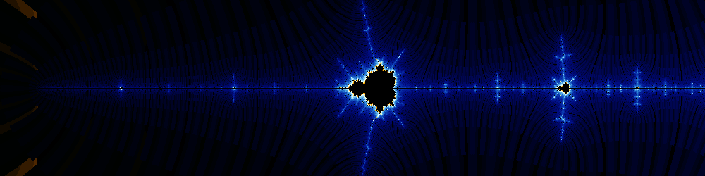

<sup>The 1st minibrot, 12h to render. 1000x250 z=32, it=64, re=-1.777 im=0</sup>

# BSD Make extravaganza.

After working with the [FreeBSD ports](https://cgit.freebsd.org/ports/tree/) system and reading a good bunch of its
makefiles plus the [make(1)](https://man.freebsd.org/cgi/man.cgi?query=make&apropos=0&sektion=0&manpath=FreeBSD+15.1-RELEASE+and+Ports.quarterly&format=html) manpage, a _lot_, I realized that the language was
[computationally universal](https://en.wikipedia.org/wiki/Computationally_universal), after this realization  I could not suppers the urge
of writing a visual demonstration and pushing `make` to its limits.

A Mandelbrot set renderer came naturally to me, since I had some prior
experience of shoving a renderer for it in places it was not designed for, and
it was a good enough all encompassing program requiring a good bit of
fundamentals to be written. It is also somewhat computationally intensive,
which is useful for demonstration purposes.

So this project was born, and here we are, a full blown Mandelbrot set renderer,
written in pure BSD make without calling any binaries.


<sup>The Mandelbrot set, 36h 18m to render. 1000x500 z=2, it=64, re=-1.4 im=0</sup>

# How to use this program:

Clone this repository:
```sh
git clone https://github.com/b-aaz/bmake-extravaganza
cd bmake-extravaganza
```
To render a low res image based on the predefined defaults:
```sh
make > output.ppm
```
The outputted image can be viewed with image viewers supporting the PPM format.

Using `ffmpeg`'s internal `ffplay` viewer:
```sh
ffplay output.ppm
```
Or the output can be converted to a more common format like a PNG:
```sh
ffmpeg -i output.ppm output.png
```
To render with different variables:
(This will render a 200x100 image with zoom level of 1)
```sh
make w=200 h=100 z=1 > output.ppm
```
__Beware!__ This is a _HORRIBLY_ inefficient renderer, the time needed for rendering
even a medium-res image, can easily shot up to a week of 100%, continues, CPU
usage based on your input variables, and system specifications.

__Tip__: Try using input variables that result in "short" calculated constants,
When the constants contain many digits (in fraction or decimal) (periodic
numbers, etc) all the adder, subtracter, multiplier, and ...  functions have to
work extra. So a higher res image with "short" constants, can "paradoxically"
take less time to render compared to a lower res image with "long"/"periodic"
constants.

For more details on the available flags use:
```sh
make help
```
# Probable questions and answers:

## 1. What's the deal with the stripes?
They are a happy accident. I haven't tried to fix them, I like the unique
patterns it makes.
It is probably due to one of the many edge cases of the sketchy "floating-point"
implementation ... .

<sup>The Mandelbrot set, 14h to render. 1000x500 z=2, it=10, re=-1.4 im=0</sup>
## 2. How to edit this?
Since Vim didn't have proper syntax highlighting for BSD make I had to write my
own, it has been quite useful for this project:
[bmake.vim](https://github.com/b-aaz/bmake.vim)
## 3. TL;DR of how it all works?
In short, the 3 basic operations of addition, subtraction, and multiplication
are all implemented based on the simple, decimal, elementary school algorithms.
(long addition, simple carry addition/subtraction)
They use simple look up tables and apply them iteratively over the input
numbers' digits.
Division, OTOH, is done by first finding the reciprocal of the denominator, with
the [Newton-Raphson method](https://en.wikipedia.org/wiki/Newton_Raphson), and then multiplying the numerator by it. (Sometimes
called "[Fast Division](https://en.wikipedia.org/wiki/Division_algorithm#Newton%E2%80%93Raphson_division)")
Everything else has been build on these primitives (and a loop "function").
Performance was given attention to during this process, but I think there is 
still a lot of room for improvements.
### 3.1. Why not use two's (or ten's) complement?
Well in these esoteric situations, many common patterns do not lead to the same
results.
The accumulated cost of the repeated inversions that require iterating over all
of a number's digits, and the cost of having to rely on the overflow mechanics
(That would require even more iterations on each single number) would slow
everything down.
### 3.2. Why some areas have no comments?
Since we are repeatedly `.include`ing these files on every single operation, every
single empty line counts, so comments had to be removed for the really hot
sections of the code, to improve performance.
## 3. Plans for anything else written in BSD-make?
That's an exercise left for the readers.
A crazy idea would be to take inspiration from this, and implement binary 
arithmetic, or even a simple ISA. The possibilities are endless.

---


